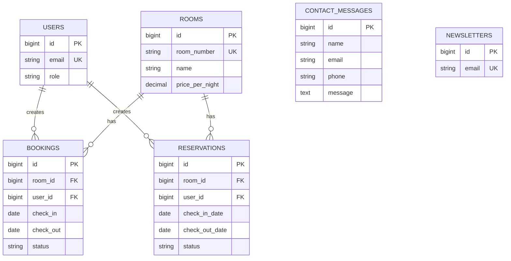

# Baza danych

Projekt uzywa MySQL. Domyslna lokalna baza w `.env.example` to `hotel_lux`.

## Tabele systemowe Laravel

- `users` - konta uzytkownikow i administratorow.
- `password_reset_tokens` - tokeny resetowania hasla.
- `sessions` - sesje, jezeli aplikacja uzywa sterownika bazodanowego.
- `cache`, `cache_locks` - cache Laravela.
- `jobs`, `job_batches`, `failed_jobs` - kolejki.
- `personal_access_tokens` - tokeny Laravel Sanctum.

## Tabele domenowe

### `users`

- `id` - klucz glowny.
- `name` - imie lub nazwa uzytkownika.
- `email` - unikalny adres e-mail.
- `email_verified_at` - opcjonalna data weryfikacji.
- `password` - zahashowane haslo.
- `role` - `client` albo `admin`.
- `remember_token`, `created_at`, `updated_at`.

### `rooms`

- `id` - klucz glowny.
- `name` - nazwa pokoju.
- `room_number` - unikalny numer pokoju.
- `capacity` - liczba osob.
- `price_per_night` - cena za noc.
- `description` - opis.
- `main_image` - sciezka do glownego zdjecia.
- `created_at`, `updated_at`.

### `bookings`

- `id` - klucz glowny.
- `room_id` - klucz obcy do `rooms.id`.
- `user_id` - opcjonalny klucz obcy do `users.id`.
- `customer_name` - dane klienta zapisane przy rezerwacji.
- `check_in`, `check_out` - daty pobytu.
- `total_price` - laczna cena.
- `status` - `active`, `confirmed` albo `cancelled`.
- `created_at`, `updated_at`.

### `reservations`

Tabela historyczna/alternatywna utworzona migracja. Aktualne API rezerwacji korzysta z tabeli `bookings`.

- `id`, `user_id`, `room_id`.
- `check_in_date`, `check_out_date`.
- `status` - `pending`, `confirmed`, `cancelled`.
- `total_price`, `created_at`, `updated_at`.

### `contact_messages`

- `id` - klucz glowny.
- `name`, `email`, `phone`, `message`.
- `created_at`, `updated_at`.

### `newsletters`

- `id` - klucz glowny.
- `email` - unikalny adres e-mail.
- `created_at`, `updated_at`.

## Relacje

- `users` 1:N `bookings`.
- `rooms` 1:N `bookings`.
- `users` 1:N `reservations`.
- `rooms` 1:N `reservations`.

## Normalizacja i CRUD

Dane pokoi, uzytkownikow i rezerwacji sa rozdzielone na osobne tabele. Rezerwacja przechowuje tylko klucze do pokoju i uzytkownika, dzieki czemu nie powiela danych pokoi. CRUD pokoi obsluguje `RoomController`, CRUD rezerwacji jest ograniczony do tworzenia, pobierania, anulowania i zmiany statusu.
